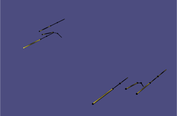

# Kinematic Three-finger Exoskeleton Animation
This application allows real-time rendering of the 
[three-finger exoskeleton](https://github.com/amartsop/Exoskeleton)
with the help of kinematically accurate hand model.
Eac finger is represented by a set of cylinders that represent the finger’s phalanges and a set of spheres representing the finger’s knuckles.
The lengths of the phalanges and knuckes are determined based
on the [configuration file](./share/hand_config.json) that correspond to the specific dimensions of the exoskeleton (see file here). To allow the accurate representation of the hand’s forward kinematics, the user can edit the
[configuration file](./share/hand_config.json) based on their exoskeleton measurements.

For more information on the software please see the reference document 
[reference document](https://github.com/amartsop/ExoskeletonHandover/blob/master/main.pdf), while for the full documentation 
please visit the [API referece](https://amartsop.github.io/Exoskeleton/).

